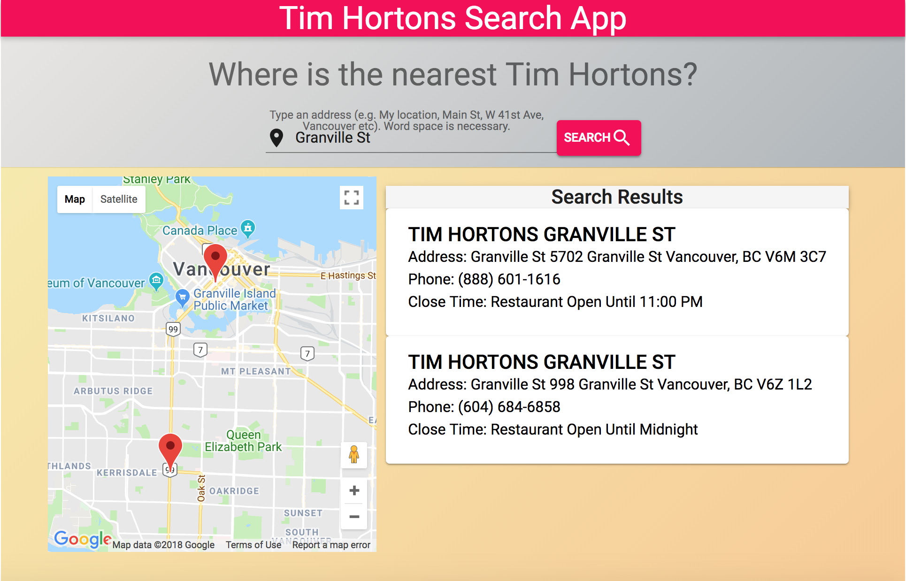

# Tim Hortons Search App

 App for finding Tim Hortons based on street names or where we are now (our current location) in Vancouver and Vicoria. 

 * Put a street name, you can get a list of shops with markers in Google map.

 * Put your current location, you can get a list of shops with markers in Google map within a 1 km radius of your current location.

 * Put "Vancouver" or "Vaictoria" if you want to know all the shops in the area. 

 

You find a demo here:

* https://timhosearch.herokuapp.com/

## Getting Started

### Prerequisites

* node => v9.3.0
* npm
* PostgreSQL => v10.4

### Google Maps API

1.  Generate a free [Google Maps API](https://cloud.google.com/maps-platform/)
2.  Put your API key into index.html 

  <script src="https://maps.googleapis.com/maps/api/js?key=Your API Key"></script>

## 1. Installing

Run the following command to install the dependencies.

```
$ npm install
```

### 2. Creating DB & Running migration & Seeding dummy data

```
$ echo "CREATE DATABASE timhortons" | psql
$ npm run migrate
$ npm run seed
```

### 3. Starting Client-Side Application

Run the folloing command to start the client-side application.

```
$ npm run hack
```

### 4. Starting Server-Side Application

Run the folloing command to start the client-side application.

```
$ npm run start
```

=> You'll see the app on http://localhost:8080!

### 5. Techlonologies Used

  * JavaScript (ES6)
  * React
  * Node.js
  * Express
  * PostgreSQL
  * Google Map API
  * Geolocation API
  * Material-Ui
  * Heroku